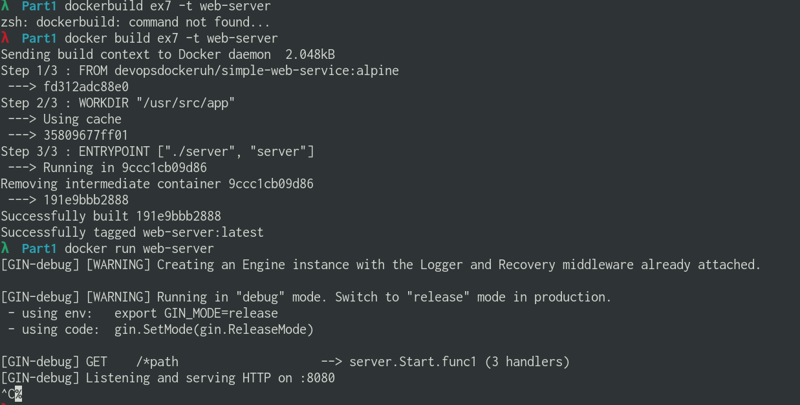

# Part 1

## Exercises

### 1.1: Getting started

```bash

# Run 3 container of nginx image
λ  devops_with_dockers_UoH_2 for i in {1..3}; do docker run -d nginx; done
c1a4cd63bfe77640192de2a6e4991bc8ec6788a340e959754dbcec4151f9b0b3
e0277972d0786e324f9fdb5f31b016e522d3d6357b6d1502a6d85ea035eeb8ab
8b22f4938bbb482b3ff89921cbd0e2a398b9a405f303a711cdd375e6c3bbddd1

λ  devops_with_dockers_UoH_2 docker container ps
CONTAINER ID   IMAGE     COMMAND                  CREATED             STATUS             PORTS     NAMES
8b22f4938bbb   nginx     "/docker-entrypoint.…"   About an hour ago   Up About an hour   80/tcp    frosty_bhabha
e0277972d078   nginx     "/docker-entrypoint.…"   About an hour ago   Up About an hour   80/tcp    festive_tu
c1a4cd63bfe7   nginx     "/docker-entrypoint.…"   About an hour ago   Up About an hour   80/tcp    confident_ishizaka

# Stop 2 containers
λ  devops_with_dockers_UoH_2 docker container stop 8b
8b
λ  devops_with_dockers_UoH_2 docker container stop e0
e0
λ  devops_with_dockers_UoH_2 docker container ps
CONTAINER ID   IMAGE     COMMAND                  CREATED             STATUS             PORTS     NAMES
c1a4cd63bfe7   nginx     "/docker-entrypoint.…"   About an hour ago   Up About an hour   80/tcp    confident_ishizaka
```


### 1.2: Cleanup

```bash

# Before clean up

λ  Part1 docker ps -a
CONTAINER ID   IMAGE         COMMAND                  CREATED             STATUS                           PORTS     NAMES
8b22f4938bbb   nginx         "/docker-entrypoint.…"   About an hour ago   Exited (0) 2 minutes ago                   frosty_bhabha
e0277972d078   nginx         "/docker-entrypoint.…"   About an hour ago   Exited (0) 2 minutes ago                   festive_tu
c1a4cd63bfe7   nginx         "/docker-entrypoint.…"   About an hour ago   Up About an hour                 80/tcp    confident_ishizaka
a6c8e2461224   nginx         "/docker-entrypoint.…"   About an hour ago   Exited (127) About an hour ago             competent_vaughan
ddc289f221e5   hello-world   "/hello"                 About an hour ago   Exited (0) About an hour ago               friendly_lumiere
9da53bfa0553   hello-world   "/hello"                 About an hour ago   Exited (0) About an hour ago               naughty_newton
50347f6aef19   hello-world   "/hello"                 2 hours ago         Exited (0) 2 hours ago                     lucid_ganguly

λ  Part1 docker images
REPOSITORY                         TAG            IMAGE ID       CREATED        SIZE
nginx                              latest         4f380adfc10f   3 days ago     133MB
hello-world                        latest         d1165f221234   3 months ago   13.3kB

# Cleanup

λ  Part1 docker container prune
WARNING! This will remove all stopped containers.
Are you sure you want to continue? [y/N] y
Deleted Containers:
0301a81412708f40a82643c05f39dd7f5509c6dbac9e85c976c4cc89bda7a50b
73f77966db9db9d0c00cacc9b3f660056c219809f2a3bbaaac3c0ce4fc121358
8b22f4938bbb482b3ff89921cbd0e2a398b9a405f303a711cdd375e6c3bbddd1
e0277972d0786e324f9fdb5f31b016e522d3d6357b6d1502a6d85ea035eeb8ab
a6c8e2461224897da83b01b6443ebe2d7c2929fd1e2bad5ef9e7cccde9473aa9
ddc289f221e5f4c26e78f8a0d1ae86e9eb81ae4a61698de629fad53f4ab79333
9da53bfa0553a6d9dc813a044647dcf83498dbbdfc6c4e29904416c05d206088
50347f6aef1959014de69e2c4290e0c87f3a3af215b7e5ab3d7222c3e00afa48

Total reclaimed space: 5.596kB

λ  Part1 docker system prune
WARNING! This will remove:
  - all stopped containers
  - all networks not used by at least one container
  - all dangling images
  - all dangling build cache

Are you sure you want to continue? [y/N] y
Total reclaimed space: 0B

λ  Part1 docker image rm hello-world

# After clean up

λ  Part1 docker images
REPOSITORY   TAG       IMAGE ID       CREATED      SIZE
nginx        latest    4f380adfc10f   3 days ago   133MB

λ  Part1 docker ps -a
CONTAINER ID   IMAGE     COMMAND                  CREATED       STATUS       PORTS     NAMES
c1a4cd63bfe7   nginx     "/docker-entrypoint.…"   2 hours ago   Up 2 hours   80/tcp    confident_ishizaka
```


### 1.3: Secret message

```bash
λ  devops_with_dockers_UoH_2 docker ps -a | grep simple-web-service
73f77966db9d   devopsdockeruh/simple-web-service:ubuntu   "/usr/src/app/server"    About a minute ago   Up About a minute                          stupefied_hertz
λ  devops_with_dockers_UoH_2 docker exec -it 73 bash
root@73f77966db9d:/usr/src/app# cat /usr/src/app/text.log
2021-06-26 22:03:18 +0000 UTC
2021-06-26 22:03:20 +0000 UTC
2021-06-26 22:03:22 +0000 UTC
2021-06-26 22:03:24 +0000 UTC
2021-06-26 22:03:26 +0000 UTC
Secret message is: 'You can find the source code here: https://github.com/docker-hy'
```


### 1.4: Missing dependencies

```bash
λ  Part1 docker run -it --name ex4 ubuntu sh -c 'apt update -qq; apt install curl --assume-yes -qq; echo "Input website:"; read website; echo "Searching.."; sleep 1; curl http://$website;'
......................................
Logs from apt update and apt install commands.
......................................
Input website:
helsinki.fi
Searching..
<!DOCTYPE HTML PUBLIC "-//IETF//DTD HTML 2.0//EN">
<html><head>
<title>301 Moved Permanently</title>
</head><body>
<h1>Moved Permanently</h1>
<ScrollWheelUp><p>The document has moved <a href="https://www.helsinki.fi/">here</a>.</p>
</body></html>
```


### 1.5: Sizes of images

```bash
λ  Part1 docker run -d --name ubuntu_ver devopsdockeruh/simple-web-service:ubuntu                                                                                          840a1c8894d165e7a4a3147b7fee9a95077d922a33e86d825924d308e2f88099
λ  Part1 docker run -d --name alpine_ver devopsdockeruh/simple-web-service:alpine
fc437b4544a1072d499d95e90ffa7e0560af5f03cc7fe022d4ec440f43270d88
λ  Part1 docker ps -a
CONTAINER ID   IMAGE                                      COMMAND                  CREATED          STATUS          PORTS     NAMES
fc437b4544a1   devopsdockeruh/simple-web-service:alpine   "/usr/src/app/server"    34 seconds ago   Up 33 seconds             alpine_ver
840a1c8894d1   devopsdockeruh/simple-web-service:ubuntu   "/usr/src/app/server"    41 seconds ago   Up 40 seconds             ubuntu_ver

λ  Part1 docker exec -it alpine_ver sh
/usr/src/app # cat /usr/src/app/text.log
2021-06-26 23:12:47 +0000 UTC
2021-06-26 23:12:49 +0000 UTC
2021-06-26 23:12:51 +0000 UTC
2021-06-26 23:12:53 +0000 UTC
2021-06-26 23:12:55 +0000 UTC
Secret message is: 'You can find the source code here: https://github.com/docker-hy'
```


### 1.6: Hello Docker Hub

```bash
λ  Part1 docker run -it devopsdockeruh/pull_exercise
Unable to find image 'devopsdockeruh/pull_exercise:latest' locally
latest: Pulling from devopsdockeruh/pull_exercise
8e402f1a9c57: Pull complete
5e2195587d10: Pull complete
6f595b2fc66d: Pull complete
165f32bf4e94: Pull complete
67c4f504c224: Pull complete
Digest: sha256:7c0635934049afb9ca0481fb6a58b16100f990a0d62c8665b9cfb5c9ada8a99f
Status: Downloaded newer image for devopsdockeruh/pull_exercise:latest
Give me the password: basics
You found the correct password. Secret message is:
"This is the secret message"
```


### 1.7: Two line Dockerfile

```bash
λ  Part1 dockerbuild ex7 -t web-server
zsh: dockerbuild: command not found...
λ  Part1 docker build ex7 -t web-server
Sending build context to Docker daemon  2.048kB
Step 1/3 : FROM devopsdockeruh/simple-web-service:alpine
 ---> fd312adc88e0
Step 2/3 : WORKDIR "/usr/src/app"
 ---> Using cache
 ---> 35809677ff01
Step 3/3 : ENTRYPOINT ["./server", "server"]
 ---> Running in 9ccc1cb09d86
Removing intermediate container 9ccc1cb09d86
 ---> 191e9bbb2888
Successfully built 191e9bbb2888
Successfully tagged web-server:latest
λ  Part1 docker run web-server
[GIN-debug] [WARNING] Creating an Engine instance with the Logger and Recovery middleware already attached.

[GIN-debug] [WARNING] Running in "debug" mode. Switch to "release" mode in production.
 - using env:   export GIN_MODE=release
 - using code:  gin.SetMode(gin.ReleaseMode)

[GIN-debug] GET    /*path                    --> server.Start.func1 (3 handlers)
[GIN-debug] Listening and serving HTTP on :8080
```

[Dockerfile](ex7/Dockerfile)



### 1.8: Image for script

```bash
λ  Part1 docker build -t curler ex8
Sending build context to Docker daemon  3.072kB
Step 1/6 : FROM alpine
 ---> d4ff818577bc
Step 2/6 : WORKDIR /usr/src/app
 ---> Using cache
 ---> c0c89cbc1a10
Step 3/6 : COPY main.sh .
 ---> Using cache
 ---> 0b281b8eb389
Step 4/6 : RUN chmod +x main.sh
 ---> Using cache
 ---> 6a88a903cab7
Step 5/6 : RUN apk update; apk add curl
 ---> Using cache
 ---> 14f054a34b00
Step 6/6 : CMD ["sh" ,"./main.sh"]
 ---> Running in 08ef5968b8f4
Removing intermediate container 08ef5968b8f4
 ---> f71de83f785d
Successfully built f71de83f785d
Successfully tagged curler:latest
λ  Part1 docker run -it curler
Input website:
helsinki.fi
Searching..
<!DOCTYPE HTML PUBLIC "-//IETF//DTD HTML 2.0//EN">
<html><head>
<title>301 Moved Permanently</title>
</head><body>
<h1>Moved Permanently</h1>
<p>The document has moved <a href="https://www.helsinki.fi/">here</a>.</p>
</body></html>
```

[Dockerfile](ex8/Dockerfile)


### 1.9: Volumes

```bash
λ  Part1 touch ex9/text.log
λ  Part1 docker run -d -v $(pwd)/ex9/text.log:/usr/src/app/text.log  devopsdockeruh/simple-web-service
974c7157a5d7d22eaa89aa0cb53f7aaae539692664b3fe592f8fc4a57b28dd9f
λ  Part1 cat ex9/text.log
2021-06-27 08:50:30 +0000 UTC
2021-06-27 08:50:32 +0000 UTC
2021-06-27 08:50:34 +0000 UTC
2021-06-27 08:50:36 +0000 UTC
```


### 1.10: Ports open

```bash
λ  Part1 docker run -d -p 3270:8080  devopsdockeruh/simple-web-service server
fb241acccbbbb883c990a1b4f0cfdeccc4801bb070a4b32f7522a543d4f05c09
λ  Part1 curl localhost:3270
{"message":"You connected to the following path: /","path":"/"}%
```


### 1.11: Spring

```bash
λ  Part1 git:(master) ✗ docker build ex11 -t spring-project
Sending build context to Docker daemon  1.904MB

λ  Part1 git:(master) ✗ docker run -d -p 8080:8080 spring-project
2c13c7ba7bc3d816b82043a01464ec3e88f64d3455a3b3c8b25ce3487941122e
```

[Dockerfile](ex11/Dockerfile)


### 1.12: Hello, frontend!

```bash
λ  Part1 git:(master) ✗ docker build ex12 -t frontend-app
Sending build context to Docker daemon  1.904MB

λ  Part1 git:(master) ✗ docker run -p 5000:5000 frontend-app      
INFO: Accepting connections at http://localhost:5000

```

[Dockerfile](ex12/Dockerfile)


### 1.13: Hello, backend!

```bash
λ  Part1 git:(master) ✗ docker run -d -p 8080:8080 go-backend
52318ca14c02855fbc0bad2ce5d10f61f6c053db99ea405385c0eeca505ffd28
```

[Dockerfile](ex13/Dockerfile)


### 1.14: Environment

```bash
λ  Part1 git:(master) ✗ docker build -f ex14/Dockerfile.front ex14 -t frontend-app --no-cache

λ  Part1 git:(master) ✗ docker build -f ex14/Dockerfile.back ex14 -t backend-app --no-cache

λ  Part1 git:(master) ✗ docker run -d -p 5000:5000 frontend-app

λ  Part1 git:(master) ✗ docker run -d -p 8080:8080 backend-app
```

[Frontend Dockerfile](ex14/Dockerfile.front)

[Backend Dockerfile](ex14/Dockerfile.back)


### 1.16: Heroku
 
[URL](https://devopwithdockertask15.herokuapp.com/)

