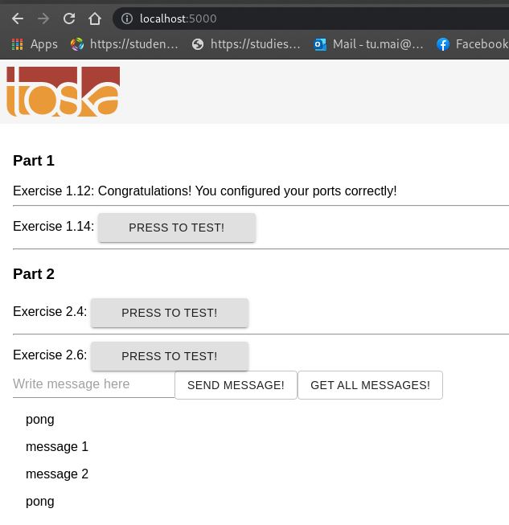

# Part 2

## Exercises

### 2.1

```bash
λ  ex1 git:(master) ✗ touch text.log
λ  ex1 git:(master) ✗ docker-compose up
Creating ex1_app_1 ... done

λ  ex1 git:(master) ✗ cat text.log
2021-06-27 20:17:01 +0000 UTC
```

[Docker-compose file](ex1/docker-compose.yml)

### 2.2

```bash
λ  ex2 git:(master) ✗ docker-compose up
Starting ex2_app_1 ... done

λ  Part2 git:(master) ✗ curl http://localhost:8080/
{"message":"You connected to the following path: /","path":"/"}%
```

[Docker-compose file](ex2/docker-compose.yml)

### 2.3

[Docker-compose file](ex3/docker-compose.yml)

```yml
version: "3.8"

services:
  frontend:
    ports:
      - 5000:5000
    build:
      context: .
      dockerfile: Dockerfile.front
  backend:
    ports:
      - 8080:8080
    build:
      context: .
      dockerfile: Dockerfile.back
```


### 2.4

[Docker-compose file](ex4/docker-compose.yml)

```bash
  backend:
    ports:
      - 8080:8080
    build:
      context: .
      dockerfile: Dockerfile.back
    environment:
      - REDIS_HOST=redis
  redis:
    image: redis
    ports:
      - 6379:6379
```


### 2.5

```bash
λ  scaling-exercise git:(main) docker-compose up --scale compute=5
```


### 2.6

[Docker-compose file](ex6/docker-compose.yml)

```yaml
version: "3.8"

services:
  frontend:
    ports:
      - 5000:5000
    build:
      context: .
      dockerfile: Dockerfile.front
  backend:
    ports:
      - 8080:8080
    build:
      context: .
      dockerfile: Dockerfile.back
    environment:
      - REDIS_HOST=redis
      - POSTGRES_HOST=database
      - POSTGRES_USER=anhtumai
      - POSTGRES_PASSWORD=password
  redis:
    image: redis
    ports:
      - 6379:6379
  database:
    image: postgres
    restart: always
    environment:
      - POSTGRES_PASSWORD=password
      - POSTGRES_USER=anhtumai
```


### 2.8

[Docker-compose file](ex8/docker-compose.yml)

```yaml
version: "3.8"

services:
  frontend:
    ports:
      - 5000:5000
    build:
      context: .
      dockerfile: Dockerfile.front
  backend:
    ports:
      - 8080:8080
    build:
      context: .
      dockerfile: Dockerfile.back
    environment:
      - REDIS_HOST=redis
      - POSTGRES_HOST=database
      - POSTGRES_USER=anhtumai
      - POSTGRES_PASSWORD=password
  redis:
    image: redis
    ports:
      - 6379:6379
  database:
    image: postgres
    restart: always
    environment:
      - POSTGRES_PASSWORD=password
      - POSTGRES_USER=anhtumai
  proxy:
    depends_on:
      - frontend
      - backend
      - redis
      - database
    restart: always
    image: nginx
    ports:
      - 80:80
    volumes:
      - ./nginx.conf:/etc/nginx/nginx.conf:ro
```


### 2.9

[Docker-compose file](ex9/docker-compose.yml)

```yml
version: "3.8"

services:
  frontend:
    ports:
      - 5000:5000
    build:
      context: .
      dockerfile: Dockerfile.front
  backend:
    ports:
      - 8080:8080
    build:
      context: .
      dockerfile: Dockerfile.back
    environment:
      - REDIS_HOST=redis
      - POSTGRES_HOST=database
      - POSTGRES_USER=anhtumai
      - POSTGRES_PASSWORD=password
  redis:
    image: redis
    ports:
      - 6379:6379
  database:
    image: postgres
    restart: always
    environment:
      - POSTGRES_PASSWORD=password
      - POSTGRES_USER=anhtumai
    volumes:
      - ./postgres-data:/var/lib/postgresql/data
  proxy:
    depends_on:
      - frontend
      - backend
      - redis
      - database
    restart: always
    image: nginx
    ports:
      - 80:80
    volumes:
      - ./nginx.conf:/etc/nginx/nginx.conf:ro
```



### 2.10

[Docker-compose file](ex10/docker-compose.yml)

```yaml
version: "3.8"

services:
  frontend:
    ports:
      - 5000:5000
    build:
      context: .
      dockerfile: Dockerfile.front
    environment:
      - REACT_APP_BACKEND_URL=http://localhost/api
  backend:
    ports:
      - 8080:8080
    build:
      context: .
      dockerfile: Dockerfile.back
    environment:
      - REDIS_HOST=redis
      - POSTGRES_HOST=database
      - POSTGRES_USER=anhtumai
      - POSTGRES_PASSWORD=password
  redis:
    image: redis
    ports:
      - 6379:6379
  database:
    image: postgres
    restart: always
    environment:
      - POSTGRES_PASSWORD=password
      - POSTGRES_USER=anhtumai
    volumes:
      - ./postgres-data:/var/lib/postgresql/data
  proxy:
    depends_on:
      - frontend
      - backend
      - redis
      - database
    restart: always
    image: nginx
    ports:
      - 80:80
    volumes:
      - ./nginx.conf:/etc/nginx/nginx.conf:ro
```


### 2.11

[Docker-compose file](ex11/docker-compose.yml)

[Demo](screenshots/ex11.webm)

App description:

This app is a final submission for this course: `https://fullstackopen.com/en/part4/structure_of_backend_application_introduction_to_testing#exercises-4-1-4-2`.
This app allows users to save information about interesting blogs they have
stumbled across on the internet.
For each listed blog we will save the author, title, url, and amount of upvotes
from users of the application.

This application contains 3 parts:

- [client side](https://github.com/anhtumai/blog-list-frontend-v2/tree/containerize)
- [server side](https://github.com/anhtumai/blog-list-backend/tree/containerize)
- database (mongodb)

I have added Dockerfile to client side and server side repos, added
a docker-compose file to spawn a web application without further setup.
