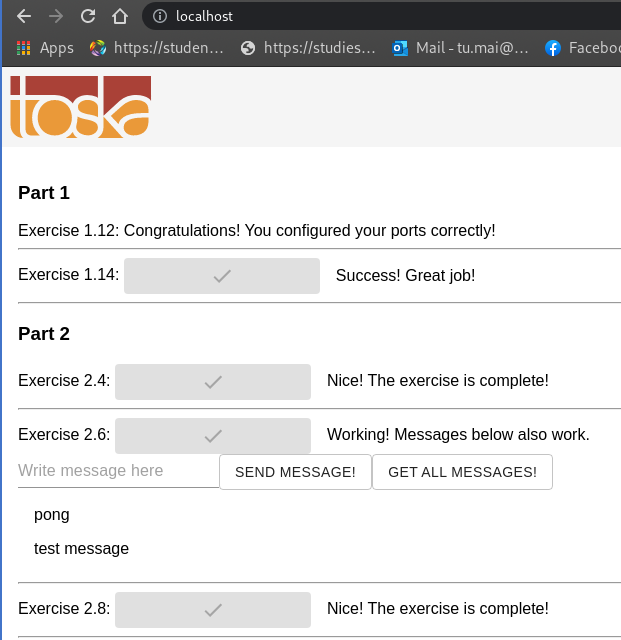

# Part 3

## Exercises

### 3.2

Bash script to clone, build and push Docker image to Docker Hub: [main.sh](./ex3/main.sh)

Docker file: [Dockerfile](./ex3/Dockerfile)

Inventory file format: [inventory](./ex3/inventory)

Usage:

```shell
$> sudo docker build . -t clone_push
$> sudo docker run -it -v /var/run/docker.sock:/var/run/docker.sock -v $PWD/inventory:/usr/src/inventory clone_push
```

### 3.3

Frontend Dockerfile: [Dockerfile](./ex3/Dockerfile.front)

Backend Dockerfile: [Dockerfile](./ex3/Dockerfile.back)

```shell
# Working directory: ./ex3
$> docker-compose build
$> docker-compose up
```


### 3.4

Frontend Dockerfile: [Dockerfile](./ex4/Dockerfile.front)

Backend Dockerfile: [Dockerfile](./ex4/Dockerfile.back)

```shell
# Working directory: ./ex4
$> docker-compose build
$> docker-compose up
```



### 3.5

Frontend Dockerfile: [Dockerfile](./ex5/Dockerfile.front)

Backend Dockerfile: [Dockerfile](./ex5/Dockerfile.back)

```shell
# Working directory: ./ex5
$> docker-compose build
$> docker-compose up
```


### 3.6

Frontend Dockerfile: [Dockerfile](./ex6/Dockerfile.front)

Backend Dockerfile: [Dockerfile](./ex6/Dockerfile.back)

```shell
# Working directory: ./ex6
$> docker-compose build
$> docker-compose up
```


